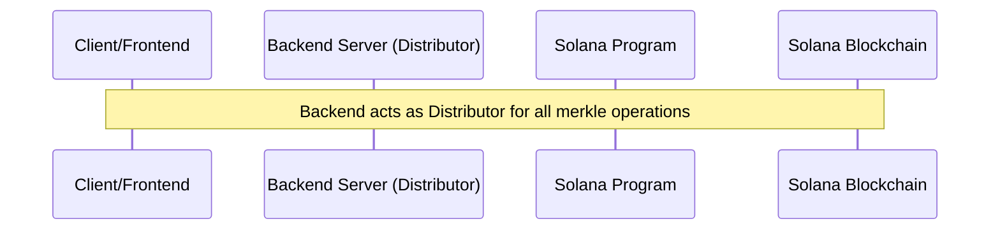
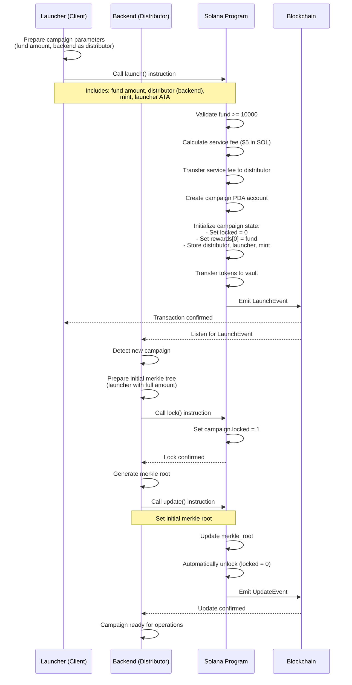
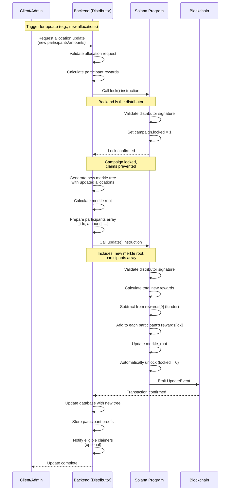
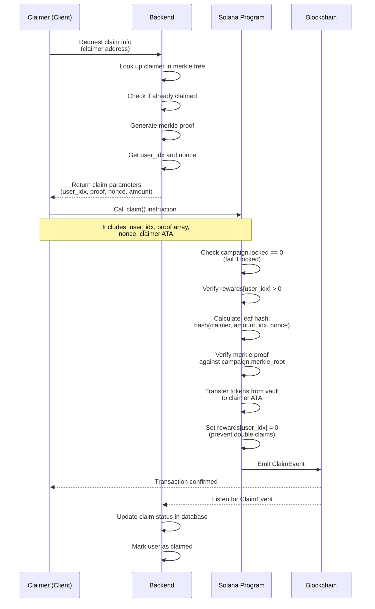
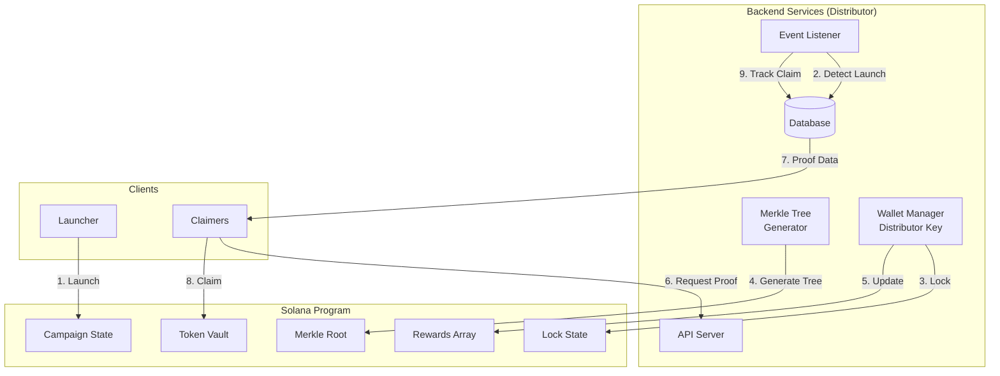
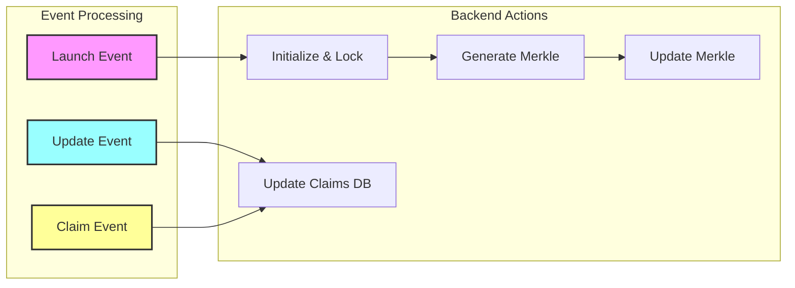
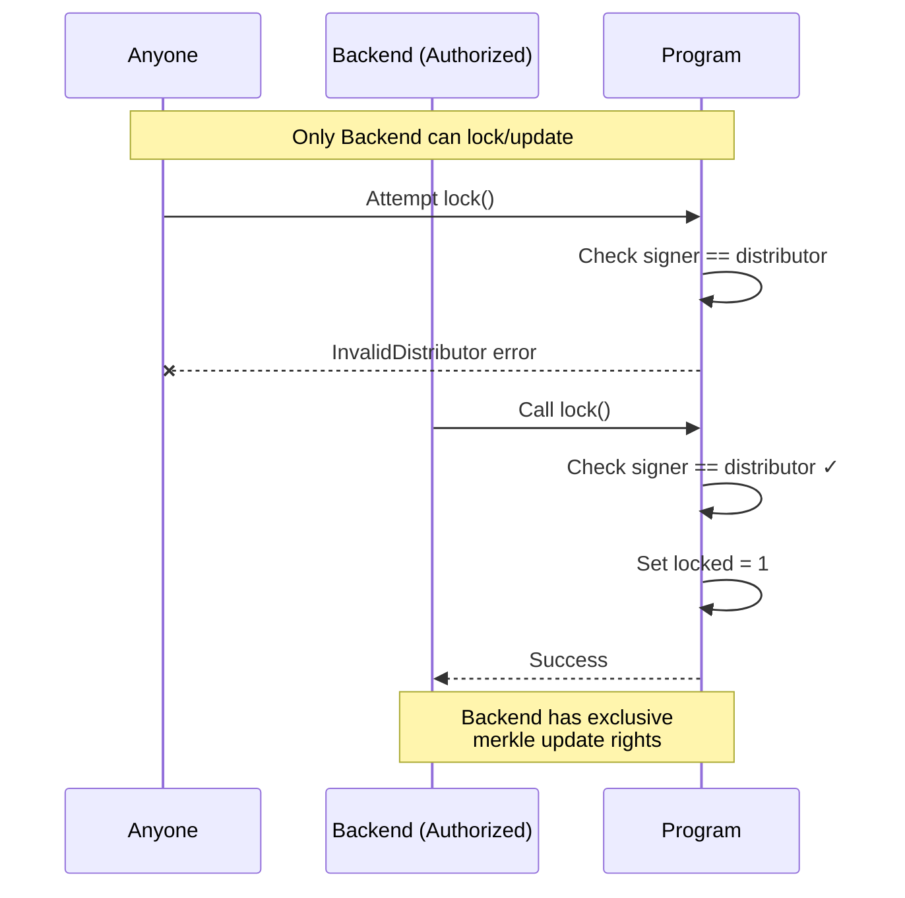

# Commi-Merkle Process Flow

## System Architecture Overview



## 1. Launch Campaign Flow



## 2. Update Merkle Root Flow (Backend-Driven)



## 3. Claim Tokens Flow



## Backend as Distributor Architecture



## State Transitions with Backend Control

```mermaid
stateDiagram-v2
    [*] --> Uninitialized
    
    Uninitialized --> Launched: Launcher: launch()
    
    state "Backend Operations" {
        Launched --> Initializing: Backend: Detect event
        Initializing --> Locked_Init: Backend: lock()
        Locked_Init --> Ready: Backend: update(initial_root)
        
        Ready --> Locked_Update: Backend: lock()
        Locked_Update --> Ready: Backend: update(new_root)
    }
    
    Ready --> Claiming: Claimer: claim()
    Claiming --> Ready: Success
    
    note right of Locked_Init
        Backend locks after launch
        to set initial merkle root
    end note
    
    note right of Locked_Update
        Backend locks before
        any merkle update
    end note
    
    note right of Ready
        Unlocked state
        Claims allowed
    end note
```

## Backend Event Processing Flow



## Security Flow with Backend as Distributor



## Complete Operation Lifecycle

```mermaid
flowchart TD
    Start([Start])
    
    Launch[Launcher: launch campaign]
    Listen[Backend: Listen for event]
    Lock1[Backend: lock()]
    Init[Backend: Generate initial merkle]
    Update1[Backend: update with initial root]
    
    Ready{Campaign Ready}
    
    NewAlloc[New Allocations Needed?]
    Lock2[Backend: lock()]
    Compute[Backend: Compute new merkle]
    Update2[Backend: update with new root]
    
    ClaimReq[User: Request claim info]
    GetProof[Backend: Provide proof]
    Claim[User: claim tokens]
    Track[Backend: Track claim]
    
    Start --> Launch
    Launch --> Listen
    Listen --> Lock1
    Lock1 --> Init
    Init --> Update1
    Update1 --> Ready
    
    Ready --> NewAlloc
    NewAlloc -->|Yes| Lock2
    Lock2 --> Compute
    Compute --> Update2
    Update2 --> Ready
    
    Ready --> ClaimReq
    ClaimReq --> GetProof
    GetProof --> Claim
    Claim --> Track
    Track --> Ready
    
    NewAlloc -->|No| ClaimReq
```

## Key Points (Updated)

1. **Launch Phase**:
   - Launcher creates campaign with backend as distributor
   - Backend immediately detects launch event
   - Backend locks campaign and sets initial merkle root
   - Campaign becomes ready for operations

2. **Backend as Distributor**:
   - Only backend can call lock() and update()
   - Backend manages all merkle tree operations
   - Backend stores distributor private key securely
   - Backend tracks all campaign events

3. **Update Phase**:
   - Backend locks before any merkle update
   - Backend computes new allocations and merkle tree
   - Update automatically unlocks after completion
   - Funder's balance (rewards[0]) reduced by allocated amounts

4. **Claim Phase**:
   - Users request claim info from backend
   - Backend provides merkle proof and parameters
   - Claims blocked when campaign is locked
   - Backend tracks successful claims via events

5. **Security Features**:
   - Only backend (as distributor) can modify merkle roots
   - Atomic lock-update-unlock pattern prevents race conditions
   - Backend controls all allocation logic
   - On-chain verification ensures claim validity